# Prerequisites

MSstats is an R package and therefore requires a previously installed version of R (>=3.6.0). If you haven't previously installed MSstats through Skyline then follow the instructions below.
Go to The R CRAN website and download R (vesion 3.6.0 or higher for MSstats 3.16.0) for your OS, install R and open an R console. MSstats itself depends on a number of other R packages, which need to be installed as well. These packages can be installed from CRAN and Bioconductor package repositories. Try executing the following commands in the R console. Click YES when you are asked to create a personal library and type a if you are asked to update all/some/none packages.


```{r, eval=F, echo=T, warning=F}
install.packages(c("gplots","lme4","ggplot2","ggrepel","reshape","reshape2", "data.table","Rcpp","survival","minpack.lm"))
```

Now install all the packages we need for MSstats from the Bioconductor repository using biocLite(): ! If you are prompted to "Update all/some/none?" Press "a"

```{r, eval=F, echo=T, warning=F}
if (!requireNamespace("BiocManager", quietly = TRUE))
    install.packages("BiocManager")
BiocManager::install("MSstats")
```

***


# Workflow in MSstats


***
# MSstats

## Load MSstats

Once you have the package installed, load MSstats into an R session and have a look at the documentation by using the question mark ?. Note that in order to use MSstats, the package needs to be loaded every time you restart R.

Load MSstats first. Then you are ready to start MSstats. 

```{r, eval=F, echo=T, warning=F}
library(MSstats)
?MSstats
```

```{r, eval=T, echo=F, warning=F}
library(MSstats, warn.conflicts = F, quietly = T, verbose = F)
#library(MSstats)
```


***

## Allowable data formats

`MSstats` performs statistical analysis steps, that follow peak identification and quantitation. Therefore, input
to MSstats is the output of other software tools (such as `Skyline`, `MaxQuant` and so on) that read raw spectral files
, identify and quantify spectral peaks. The preferred structure of data for use in MSstats is a .csv file
in a *long* format with at least 10 columns representing the following variables: **ProteinName**, **PeptideSequence**, **PrecursorCharge**, **FragmentIon**, **ProductCharge**, **IsotopeLabelType**, **Condition**, **BioReplicate**, **Run**, **Intensity**. The variable names are fixed, but are case-insensitive.

```{r, eval=T, echo=F, warning=F}
head(DDARawData)
```

***
## Preparing the data for MSstats input
In skyline, go to **File** > **Export** > **Report...** > select **MSstats Input** > click **Export** > choose folder and save the file as **MSstats_Input.csv** > click **Save**

Create an RStudio project in the folder where you saved the file exported from Skyline. From the menu, select **File** > **New Project...**, then select **Existing Directory** and choose the directory where you downloaded this script and the example datasets for this tutorial. All the output files we'll be creating in this tutorial will be saved in the 'working directory' that now has been set by RStudio.

**note : add captue**

Check where you are using **getwd()**

```{r}
getwd()

```

***

## Convert to MSstats required format (Data cleaning)

***
Let's start preprocessing steps to make required input format for MSstats from output from diverse output of spectral processing tools.


- Data input support for various data acquisition methods : DDA, DIA, SRM

- Interoperability with existing computational tools :
      - Converter functions for 7 data processin tools : 
      `SkylinetoMSstatsFormat`, `MaxQtoMSstatsFormat`, `OpenMStoMSstatsFormat`, `ProgenesistoMSstatsFormat`, `PDtoMSstatsFormat`, `SpectronauttoMSstatsFormat`, `OpenSWATHtoMSstatsFormat`, `DIAUmpiretoMSstatsFormat`
      - Consistent data cleaning steps across converter functions : filter multiple measurements, shared peptides, etc.
      - Generate the same format of data from diverse type of data format.


### Read data

Then, read in data as it comes out of Skyline. 

```{r}
# Read output from skyline 
raw <- read.csv('data/MSstats_Input.csv')
```

Use head() function to display the first few (6) rows of the data, and colnames() to see what the columns are. They should match the columns we previewed in Skyline.

```{r}
head(raw)
colnames(raw)
```

Use another useful function str(), to display a summary of each column in our raw dataframe.
```{r}
str(raw)
```

Notice that some rows are type "Factor" and some rows are type "int". Although we will avoid any object type conflicts in this tutorial, you can learn more about object types through the R Documentation ?typeof(). For now, it's enough to just acknowledge that they exist!


There are some column named differently than required input. The information for `Condition` and `BioReplicate` is missing. Let's do preliminary check for this input.

```{r}
# total number of unique protein name
length(unique(raw$Protein))

# several isotopic peaks for peptide charge
unique(raw$FragmentIon)

# unique FileName, which is MS run.
unique(raw$FileName)

# 'Truncated' column
unique(raw$Truncated)

# count table for 'Truncated' column
xtabs(~Truncated, raw)

# count which 'Truncated' is 'True'
sum(raw$Truncated == 'True')
```


### Common mistake for annotation file : Incorrect `BioReplicate` information

`MSstats` distinguish the design of experiment as group comparison, time course, paired design, with the combination of `Condition`, `BioReplicate`, and `Run`.


#### Group comparison 
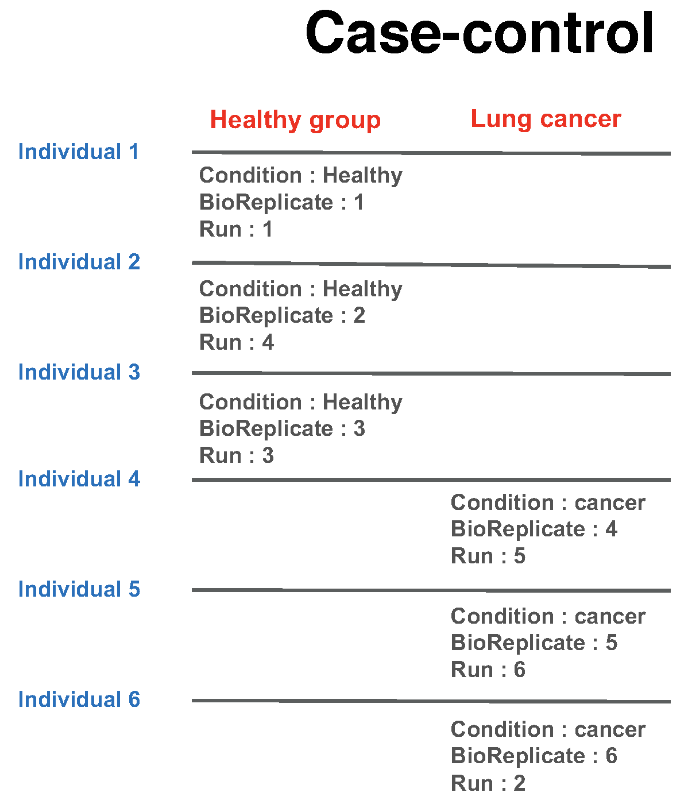{width=40%}

In a group comparison design, the conditions (e.g., disease states) are profiled across **non-overlapping sets of biological replicates (i.e., subjects)**. In this example there are 2 conditions, Disease and Control (in general the number of conditions can vary). There are 3 subjects (i.e., biological replicates) per condition (in general an equal number of replicates per condition is not required). Overall, in this example there are 2 × 3 = 6 mass spectrometry runs.

The most important is that 1) subject IDs for disease group are completely different thatn subject IDs for control group 2) `Run` is not order of spectral acquisition, but just unique MS run ID.


In addition, if each subject has e technical replicate runs (in general technical replicates are not required, and their number per sample may vary). there are 2 × 3 × 3 = 18 mass spectrometry runs.

#### Time course

The important feature of a time course experimental design is that **a same subject (i.e., biological replicate) is repetitively measured across multiple time points**. In this example there are 3 time points, Time1, Time2, and Time3 (in general the number of times can vary). There are 3 subjects (i.e., biological replicates) measured across times (in general an equal number of times per replicate is not required). There are no technical replicates (in general the number of technical replicates per sample may vary). Overall, in this example there are 3 × 3 = 9 mass spectrometry runs.

{width=60%}

#### Paired design

Another frequently used experimental design is a *paired design*, where measurements from **multiple conditions (such as healthy biopsy and disease biopsy) are taken from a same subject**. The statistical model for this experimental design is the same as in the time course experiment, however the values in the columns of the input data may have a different appearence. In this example there are 3 subjects (in general the number of patients can vary). There are three  conditions per subject (in general the number of conditions per subject can exceed two). Overall, in this example there are $2  \times 3 = 6$ mass spectrometry runs. `BioReplicate` should indicate each individual ID.

{width=60%}

### Preprocessing with `SkylinetoMSstatsFormat`

Now we'll adapt the column scheme of the dataset so that it fits MSstats input format. The SkylinetoMSstatsFormat() function helps pre-processing for making the Skyline export play nicely with MSstats functions. For example, it removes iRT peptides, renames some column name, and replaces truncated peak intensities with NA.


The input data for `MSstats` is required to contain variables of **ProteinName**, **PeptideSequence**, **PrecursorCharge**, **FragmentIon**, **ProductCharge**, **IsotopeLabelType**, **Condition**, **BioReplicate**, **Run**, **Intensity**. These variable names should be fixed. `MSstats` input from Skyline adapts the column scheme of the dataset so that it fits `MSstats` input format. However there are several extra column names and also some of them need to be changed.  `SkylinetoMSstatsFormat` function helps pre-processing for making right format of MSstats input from Skyline output. For example, it renames some column name, and replace truncated peak intensities with NA. Another important step is to handle isotopic peaks before using `dataProcess`. The output from Skyline for DDA experiment has several measurements of peak area from the monoisotopic, M+1 and M+2 peaks. To get a robust measure of peptide intensity, we can sum over isotopic peaks per peptide or use the highest peak. Here we take a summation per peptide ion.

Here is the summary of pre-processing steps in `SkylinetoMSstatsFormat` function (in orange box below).


For further details, visit the help file using the following code.
```{r, eval=F}
?SkylinetoMSstatsFormat
```


```{r}
# reformating and pre-processing for Skyline output.
raw_msstats <- SkylinetoMSstatsFormat(raw, filter_with_Qvalue = FALSE)
```

You may see a warning message telling you that "NAs introduced by coercion". This is okay! Let's check what changed in our processed dataframe using the str() command.

```{r}
str(raw_msstats)
```

Notice some columns were renamed, and also one column (previously "Area", now renamed "Intensity"), changed object type! Remember I said we would avoid type conflicts in this tutorial? It's enough just to acknowledge that this changed, but if you continue using R for your own data, you will likely run into object conflicts in the future and hopefully knowing this helps you troubleshoot!

### Preliminary check

So far, we've only looked at the processed dataframe raw_msstats at a high level. Let's pull out just one column from the dataframe, the ProteinName column, and ask R how many unique proteins are in our data.

```{r}
length(unique(raw_msstats$ProteinName)) 
sum(is.na(raw_msstats$Intensity)) 
sum(!is.na(raw_msstats$Intensity) & raw_msstats$Intensity==0)
```

You should have 48 levels listed, which is exactly what we expected from our Skyline document! Let's practice with one more, how many unique peptides are in our dataframe?

```{r}
unique(raw_msstats$PeptideSequence)
```
What else can you summarize about the dataframe?


***
## Data processing - Normalization and run summarization

Let's start processing steps. It includes log transformation of intensities, normalization and run-level summarization.


### Normalizing and summarizing data with dataProcess

To get started with this function, visit the help section of `dataProcess` first: 

```{r,eval=FALSE}
?dataProcess
```

`dataProcess` perform (1) normalization first. The default option for normalization is `equalizeMedians`. `equalizeMedians' fits for label-based SRM experiments, which we can use reference signals. There are three more options for normalization. Depending on the suitable assumption for your experiment, you can choose one of them.

Then, (2) run level summarization will be performed including missing value imputation by accerelated failure model and robust parameter estimation by TMP (Tukey's median polish).

Below show the default for all options in dataProcess except `censoredInt`. `censoredInt='0'` should be used for Skyline output.

**Note:** do pay attention to the default options, which may not be appropriate in some situations and need to be changed. For example, the default option for normalization is equalizeMedians. If you have a spiked in standard, you may set this to globalStandards and define the standard with nameStandards.


```{r, eval=T, message=F, warning=F}
quant_tmp <- dataProcess(raw = raw_msstats, 
                         normalization="globalStandards", 
                         nameStandards="VVLSGSDATLAYSAFK",
                         censoredInt = '0')
```


Let's check output from `dataProcess`.

```{r, eval=T, echo=T}
# show the name of outputs
names(quant_tmp)

# show reformated and normalized data.
# 'ABUNDANCE' column has normalized log2 transformed intensities.
head(quant_tmp$ProcessedData)

# This table includes run-level summarized log2 intensities. (column : LogIntensities)
# Now one summarized log2 intensities per Protein and Run.
# NumMeasuredFeature : show how many features are used for run-level summarization.
#         If there is no missing value, it should be the number of features in certain protein.
# MissingPercentage : the number of missing features / the number of features in certain protein.
head(quant_tmp$RunlevelData)

# show which summarization method is used.
head(quant_tmp$SummaryMethod)
```

Note that the above command, although we only specify two parameters, raw and censoredInt, is running with all the other parameters, they're just automatically set to default. So, for example, the line above is the same as the line below. Note: censoredInt='NA' for the input from other spectral tools.

```{r, eval=T, message=F, warning=F}
quant_tmp <- dataProcess(raw = raw_msstats, 
                        logTrans = 2, 
                        normalization = "equalizeMedians", 
                        fillIncompleteRows = TRUE, 
                        featureSubset = "all", 
                        remove_uninformative_feature_outlier = FALSE, 
                        summaryMethod = "TMP", 
                        censoredInt = "0", 
                        cutoffCensored = "minFeature", 
                        MBimpute = TRUE)
```

Output of the dataProcess() function contains the processed and run-level summarized data as well as relevant information for the summarization step. Let's unpack the output from dataProcess(), which we named quant_tmp above, so that we can be more familiar with what we just did to our data.


### No normalization
```{r, eval=T, message=F, warning=F}
quant_nonorm <- dataProcess(raw = raw_msstats, 
                            normalization=FALSE,
                            censoredInt = '0')
```

What's the difference between two normalization methods? 
With different methods for normalization, the summarized values are different. Let's pull out the RunlevelData from each object, the quant_tmp object that used global standard peptide for normalization and the quant_nonorm object that did not apply any normalization. Specifically, look at the column named LogIntensities.

```{r}
head(quant_tmp$RunlevelData)
head(quant_nonorm$RunlevelData)
```

***

### Visualization of processed data

Next we'll be using the dataProcessPlots function to visualize our data. To get the documentation for this function, we can again use the ? symbol.

```{r, eval=F}
?dataProcessPlots
```

#### Quality control plots

Now let's look at what the equalize medians procedure did to our data. 
The QCplot type shows boxplots of peak intensities (on log scale) in all runs, where the bottom and top of a box represent the first and third quartiles of the log-intensities and the band inside the box is the median. It provides a quick way to examine and compare distributions between runs, and to detect systematic bias. Also, it is good visualization to check normalization. However, not good to see individual intensities.

```{r, eval=F, message=F, warning=F}
dataProcessPlots(data = quant_tmp, type = "QCplot", address = 'MSstats_')
```
By running the above command, TMP_QCPlot.pdf is generated in the working directory. If you can't find the plot, remember you can use getwd() to see where your working directory is.

Here's what the QC plot would look if we did normalize with global standard.

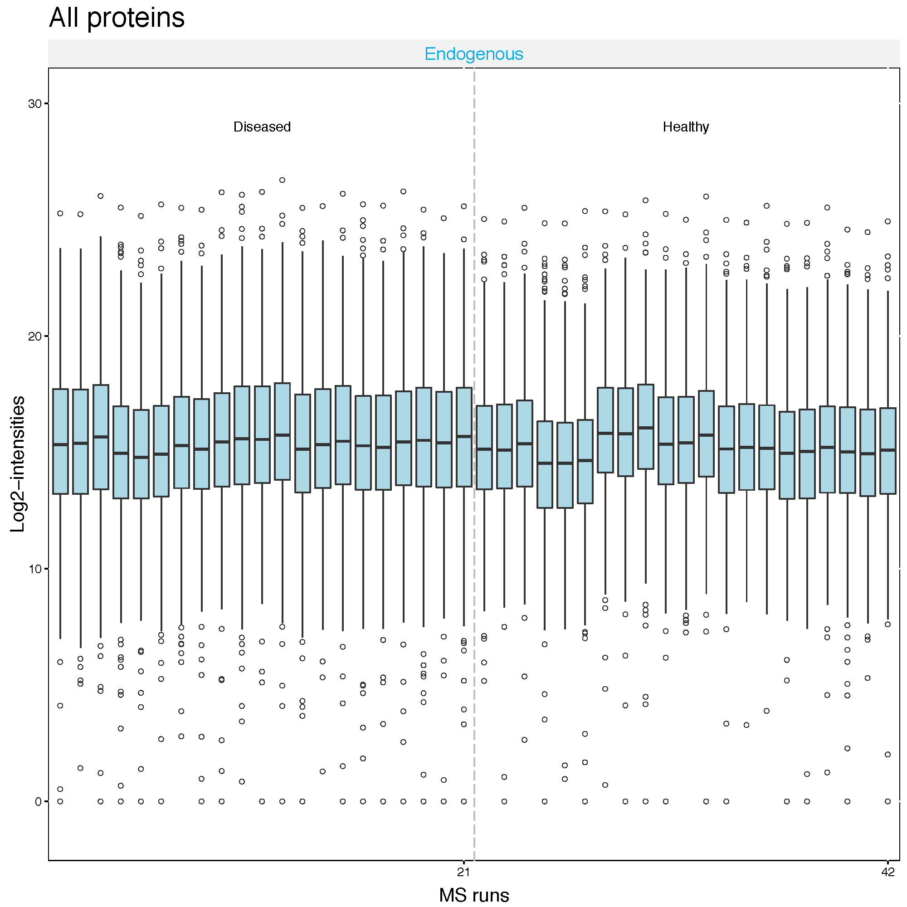

Here's what the QC plot would look if we didn't normalize.


```{r, eval=F, echo=F, message=F, warning=F}
dataProcessPlots(data = quant_nonorm, type = "QCplot", which.Protein='allonly',
                 address = FALSE)
```

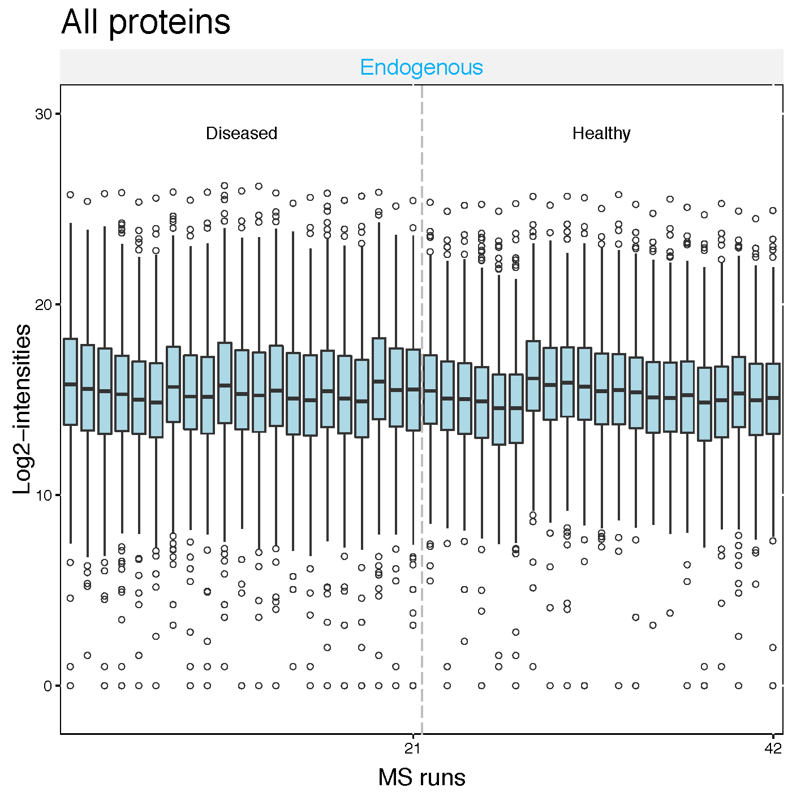


#### Profile plots

Profile plot shows individual observations for each protein. It is useful to examine the consistency of measurements in feature, run and condition, and to detect potential source of variation and missingness in the data. Each dot represents one feature intensity.

```{r, eval=F}
dataProcessPlots(data = quant_tmp, type="Profileplot", 
                 width = 7, height = 7, address = "MSstats_")
```

By running the above command, two files **MSstats_ProfilePlot.pdf** and **MSstats_ProfilePlot_wSummarization.pdf** are generated in the current directory.

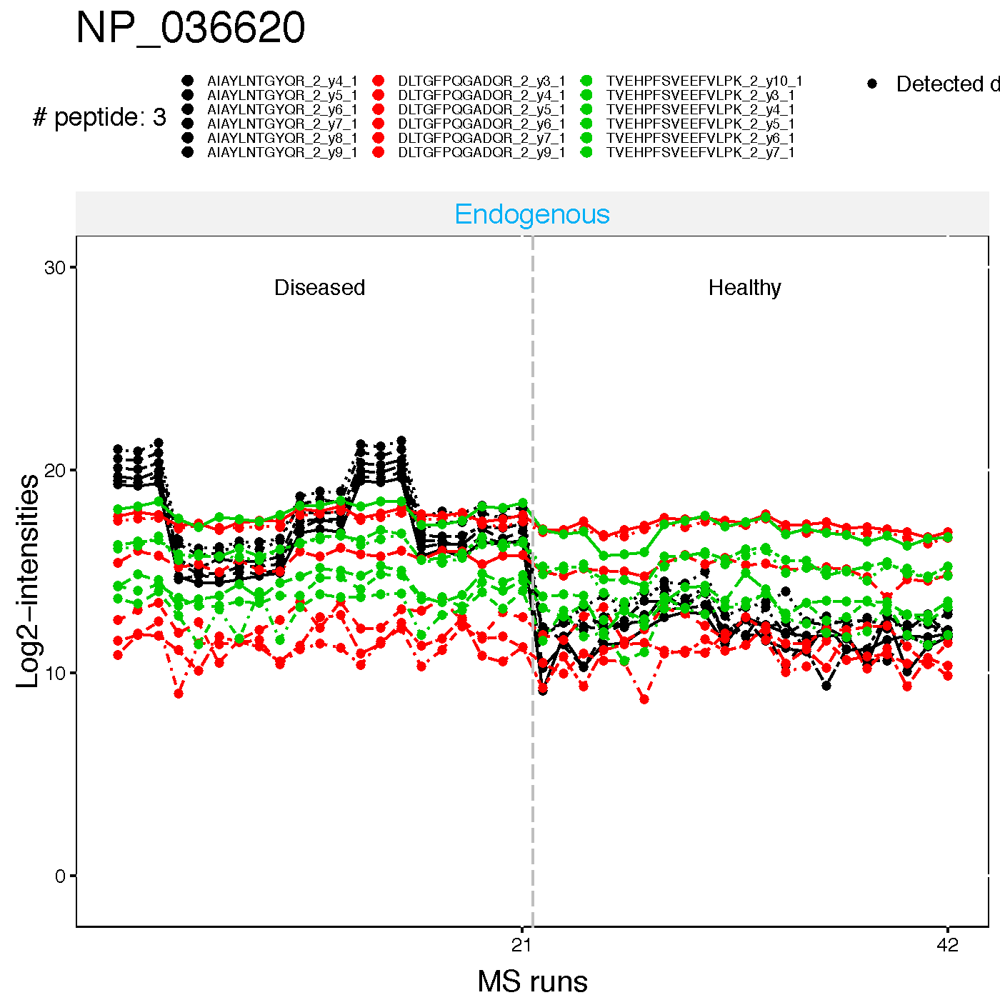

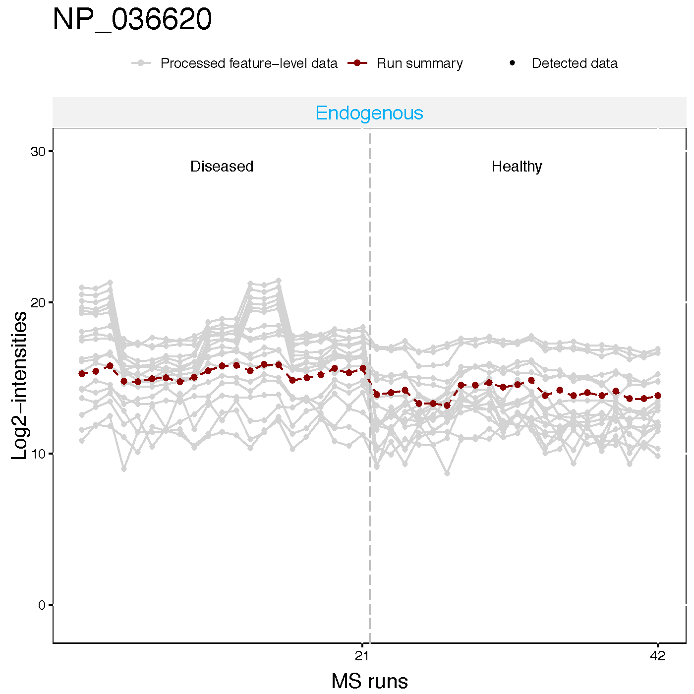


The dots are connected by a line per feature. If a line is disconnected, it means there is no value (missing value). Colors represent different peptides and charge states.

Parallel profiles on log scale correspond to consistent peak area percentage, from which we gain confidence in the integration of the peptide. When any inconsistency is observed, we should look into the data before conducting subsequent analysis.

Let's compare these results from global standard normalization to the results we get when we use no normalization. To do this, we can simply run the same command, but replace the data = quant_tmp parameter setting with the linear model dataframe quant_nonorm:

```{r, eval=F}
dataProcessPlots(data = quant_nonorm, type="Profileplot", 
                 width = 7, height = 7, address = "MSstats_nonorm_")
```

Check the generated plots in your working directory and see how each method summarizes the data in different ways.

We can generate these for all proteins but also for single proteins at a time. Suppose we just want to generate a plot for S. We can specify a particular protein using the **which.Protein** parameter, and setting that parameter to the protein. (Tip: to see all the unique proteins in quant_tmp, you can use unique(quant_tmp$ProcessedData$PROTEIN).)

```{r, eval=F}
dataProcessPlots(data = quant_tmp, type="Profileplot", 
                 originalPlot = TRUE, summaryPlot = FALSE,
                 which.Protein = 'S',
                 width = 7, height = 7, address = FALSE)
```


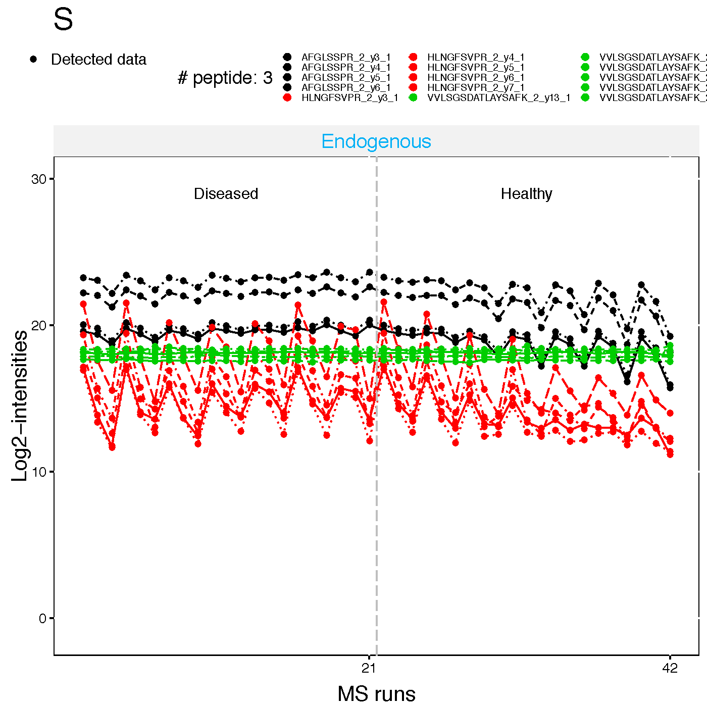

```{r, eval=F}
dataProcessPlots(data = quant_nonorm, type="Profileplot", 
                originalPlot = TRUE, summaryPlot = FALSE,
                which.Protein = 'S',
                 width = 7, height = 7, address = FALSE)
```

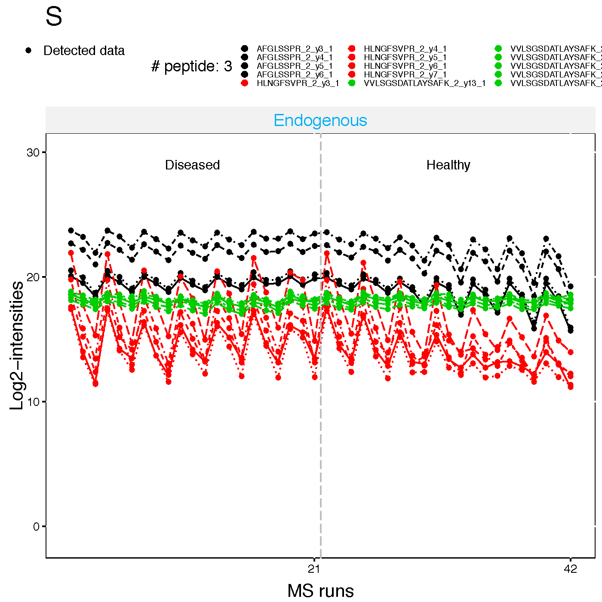


#### Condition plots

The Conditionplot type shows the mean of log-intensity and the 95% confidence interval for each condition. Although this visualization is helpful to get a feel for the data, if we want to say whether a protein is differentially abundant between conditions, this plot is not sufficient and group comparison analysis needs to be conducted! For now, these plots simply provide some helpful summary visualizations of the data.

```{r, eval=F}
dataProcessPlots(data = quant_tmp, type = "conditionplot", 
                 width = 7, height = 7,
                 address = "MSstats_")
```

We can draw the condition plot for a protein, `NP_036620` .

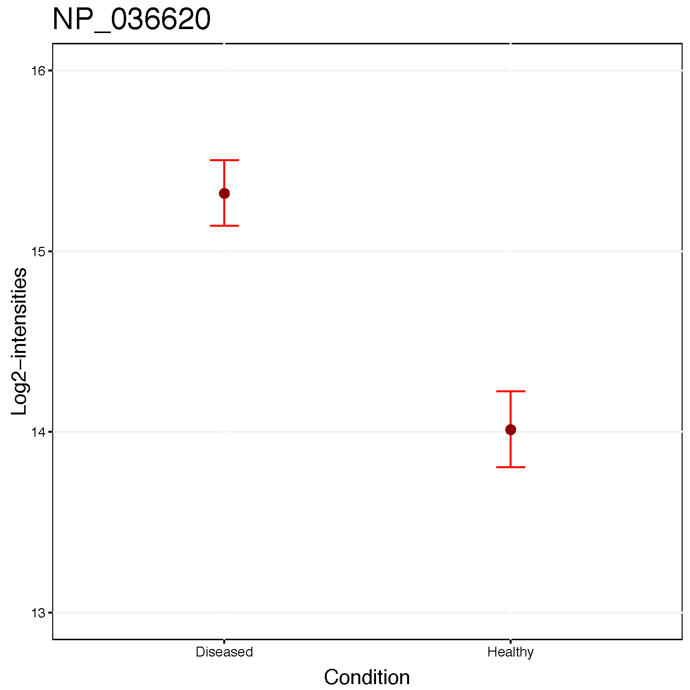

Glance through the plots created by the conditionplot type. Are there any proteins that look interesting? Remember, just having the plot doesn't tell us if the differential expression is significant! To make that claim, we need to do the group comparison.

***

### Different normalization option
Let's see the different normalization effect with SRM dataset including two proteins

```{r}
head(SRMRawData)
unique(SRMRawData$ProteinName)
```

#### No normalization
No normalization is performed. If you had your own normalization before `MSstats`, you should use like below.
```{r, eval=FALSE}
srm.nonorm <- dataProcess(SRMRawData, normalization=FALSE)
dataProcessPlots(srm.nonorm, type='QCplot', address='srm_noNorm_')
```

{width=50%}

#### Equalize medians normalization
The default option for normalization is 'equalizeMedians', where all the
intensities in a run are shifted by a constant, to equalize the median of intensities across runs for
label-free experiment. This normalization method is appropriate **when we can assume that the
majority of proteins do not change across runs**. Be cautious when using the `equalizeMedians`
option for a label-free DDA dataset with only a small number of proteins. For label based experiment,
`equalizeMedians` equalizes the median of reference intensities across runs and is generally proper
even for a dataset with a small number of proteins.

```{r, eval=FALSE}
srm.equalmed <- dataProcess(SRMRawData, normalization = 'equalizeMedians')
dataProcessPlots(srm.equalmed, type='QCplot', address='srm_equalM_')
```

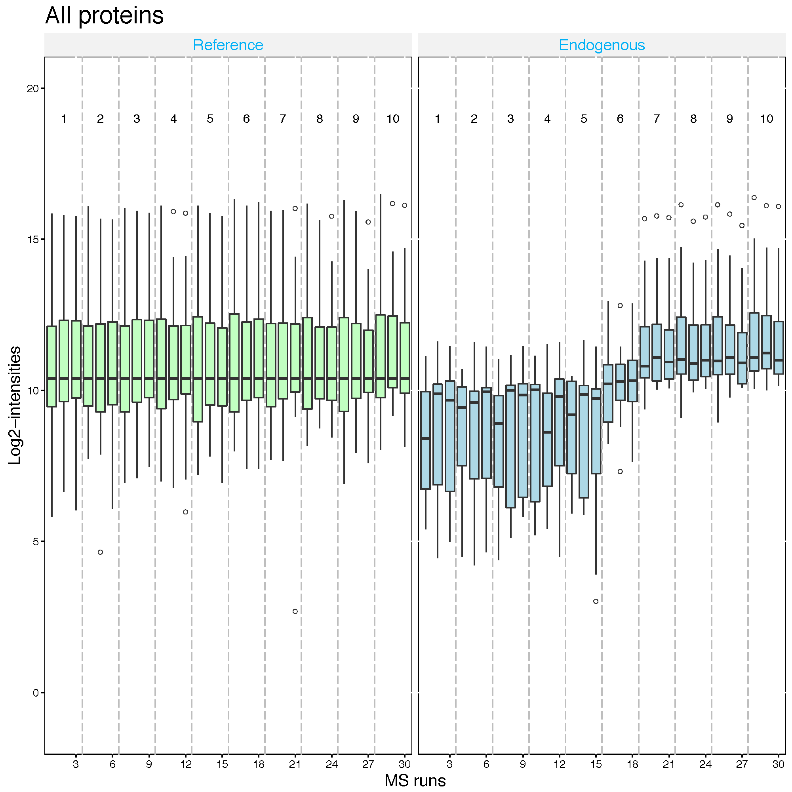{width=50%}

#### Quantile normalization
The distribution of all the intensities in each run will become the same across runs for
label-free experiment. For label-based experiment, the distribution of all the reference intensities
will be become the same across runs and all the endogenous intensities are shifted by a constant
corresponding to reference intensities.

```{r, eval=FALSE}
srm.quantile <- dataProcess(SRMRawData, normalization='quantile')
dataProcessPlots(srm.quantile, type='QCplot', address='srm_quantile_')
```

{width=50%}
#### Global standards normalization : example 1
If you have a spiked in standard across all MS runs, you may set this to `globalStandards` and define the standard with `nameStandards` option. Global standard peptide or Protein names, which you can assume that they have the same abundance across MS runs, should be assigned in the vector for this option.

First, let's assume that `PMG2` proteins is the spike-in protein and shoule be equal amount across MS runs.

```{r, eval=FALSE}
srm.global.pmg2 <- dataProcess(SRMRawData, normalization ='globalStandards',
                               nameStandards = 'PMG2')
dataProcessPlots(srm.global.pmg2, type='QCplot', address='srm_global_PMG2_')
```
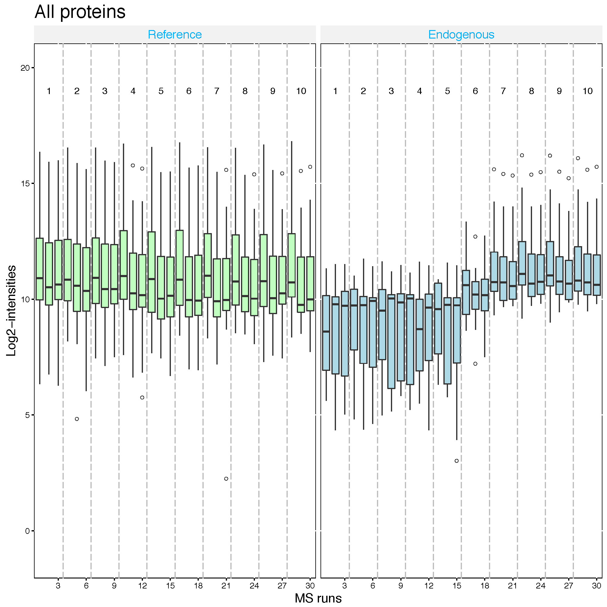{width=50%}


Second, let's assume that `IDHC` proteins is the spike-in protein and shoule be equal amount across MS runs.

#### Global standards normalization : example 2
```{r, eval=FALSE}
srm.global.idhc <- dataProcess(SRMRawData, normalization ='globalStandards',
                               nameStandards = 'IDHC')
dataProcessPlots(srm.global.idhc, type='QCplot', address='srm_global_IDHC_')
```
{width=50%}


***
## Group comparison to find differentially abundant proteins across conditions

{width=90%}

After we normalized the data and summarized each protein's behaviour across conditions in `dataProcess` step, we are all set to compare protein changes between groups of conditions. Within MSstats we can do this with the `groupComparison` function, which takes as input the output of the `dataProcess` function. 

```{r}
?groupComparison
```


### Assign contrast matrix

We have to tell `groupComparison` which are the conditions we would like to compare.
You can make your `contrast.matrix` in R in a text editor. We define our contrast matrix by adding a column for every condition, **in alphabetical order**. We add a row for every comparison we would like to make between groups of conditions.  

**0** is for conditions we would like to ignore.
**1** is for conditions we would like to put in the numerator of the ratio or fold-change.
**-1** is for conditions we would like to put in the denumerator of the ratio or fold-change.

This part is a bit confusing, but it is absolutely critical! If the contrast matrix is set up incorrectly, our data will not be analyzed correctly. Our data has two groups, Diseased and Healthy. It's common to place the experimental group over the control group, so that changes are "upregulated/downregulated" in the experimental group.

```{r, eval=TRUE}
# check unique conditions and check order of condition information
levels(quant_tmp$ProcessedData$GROUP_ORIGINAL)

# create a contrast matrix for Diseased vs Healthy
comparison <- matrix(c(1, -1), nrow=1)
row.names(comparison) <- c("Diseased-Healthy")
comparison
```


### Comparing conditions with `groupComparison` 

`groupComparison` uses the run-level summarized data (`$RunlevelData` from `dataProcess` function) for hypothesis testing. Now that we have our contrast matrix, we can feed it to the contrast.matrix parameter of the groupComparison function.

```{r, eval=T, message=F, warning=F}
gpcomp_tmp <- groupComparison(contrast.matrix = comparison, data = quant_tmp)
```


Let's check the output.

```{r, eval=TRUE}
class(gpcomp_tmp)

names(gpcomp_tmp)

# Show test result
# Label : which comparison is used
# log2FC : estimated log2 fold change between Diseased and Healthy
# adj.pvalue : adjusted p value
# issue : detect whether this protein has any issue for comparison
#    such as, there is measurement in certain group, or no measurement at all.
# MissingPercentage : the number of missing intensities/total number of intensities 
#     in conditions your are interested in for comparison
# ImputationPercentage : the number of imputed intensities/total number of intensities 
#     in conditions your are interested in for comparison
head(gpcomp_tmp$ComparisonResult)

# After fitting linear model, residuals and fitted values can be shown.
head(gpcomp_tmp$ModelQC)

# Fitted model per protein
head(gpcomp_tmp$fittedmodel)
gpcomp_tmp$fittedmodel[[1]]
```


Show only the results for significant changes.

```{r}
# pull just the results out of the whole group comparison output
gpcomp_res <- gpcomp_tmp$ComparisonResult

# subset only proteins with adjusted p-value < 0.05 and a FC > 2^2
list_sig <- gpcomp_res[gpcomp_res$adj.pvalue < 0.05 & abs(gpcomp_res$log2FC) > 2 , ]
head(list_sig)
nrow(list_sig)
```

### Save the comparison result 

Let's save the testing result as rdata and .csv file.

```{r, eval=T, message=F, warning=F}
save(gpcomp_res, file='gpcomp_res.rda')
write.csv(gpcomp_res, file='testresult_wglobalstandNorm.csv')
```

***

## Visualization of differentially abundant proteins

```{r, eval=FALSE}
?groupComparisonPlots
```

### Volcano plot

Volcano plot summarizes all the proteins with respect to their practical significance (log2 [fold change]) and statistical significance (-log10 [adjusted p-value]). Proteins with greater values on the y axis are more statistically significant. Changes with an adjusted p-value less than a significance level (default of 0.05) are considered as statistically significant. Up-regulated and down-regulated proteins are shown in red and blue, respectively.

```{r, eval=F}
groupComparisonPlots(data = gpcomp_tmp$ComparisonResult, 
                     type = 'VolcanoPlot',
                     sig = 0.05, FCcutoff = 2^2, 
                     address = 'MSstats_')
```

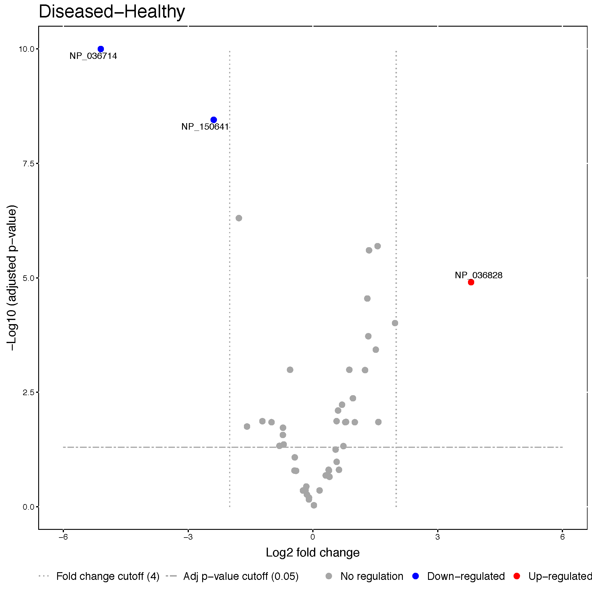{width=60%}

### Heatmap

Heatmaps are useful to visualize the results of multiple comparisons at once. In this tutorial, we only had one comparison (Diseased vs Healthy), but I'm leaving this code here so that you can recycle it if you do a multi-way comparison in the future!


```{r, eval=F}
groupComparisonPlots(data = gpcomp_tmp$ComparisonResult, 
                     type = 'Heatmap', 
                     address = 'MSstats_')
```

### Comparison plot

Comparison plots illustrate model-based estimates of log-fold changes, and the associated uncertainty, in several comparisons of conditions for one protein. X-axis is the comparison of interest. Y-axis is the log fold change. The dots are the model-based estimates of log-fold change, and the error bars are the model-based 95% confidence intervals (the option sig can be used to change the significance level of significance). For simplicity, the confidence intervals are adjusted for multiple comparisons within protein only, using the Bonferroni approach. For proteins with N comparisons, the individual confidence intervals are at the level of 1-sig/N.

```{r, eval=F}
groupComparisonPlots(data = gpcomp_tmp$ComparisonResult,
                     type = 'ComparisonPlot', 
                     address = 'MSstats_')
```


***

## Planning future experimental designs

{width=90%}


This last analysis step views the dataset as a pilot study of a future experiment, utilizes its variance components, and calculates the minimal number of replicates required in a future experiment to achieve the desired statistical power. The calculation is performed by the function `designSampleSize`, which takes as input the fitted model in `groupComparison`. Sample size calculation assumes same experimental design (i.e. group comparison, time course or paired design) as in the current dataset, and uses the model fit to estimate the median variance components across all the proteins. Finally, sample size calculation assumes that a large proportion of proteins (specifically, 99%) will not change in abundance in the future experiment. This assumption also provides conservative results.
Using the estimated variance components, the function relates the number of biological replicates per condition (`numSample`, rounded to 0 decimal), average statistical power across all the proteins (`power`), minimal fold change that we would like to detect (can be specified as a range, e.g. `desiredFC=c(1.1, 2)`), and the False Discovery Rate (`FDR`). The user should specify all these quantities but one, and the function will solve for the remainder. The quantity to solve for should be set to `= TRUE`.

Above, when we made our volcano plot, we use 2^2 as the fold-change cut off, but that number is experiment-dependent! Some strongly-powered experiments can achieve fold-change sensitivities like 1.25, but other poorly-powered experiments may not be sensitive to even 5 FC.


```{r, eval=FALSE}
?designSampleSize
```


### Designing sample size for desired fold-change

The designSampleSize function has three major parameters that can be manipulated to explore the range of samples, desired FC, or statistical power. It's most common to fix the power at 0.8 or 0.9 to explore how varying the FC or sample size affects an experiment.

```{r, eval=T}
# calculate the number of samples to achieve a range of fold changes from 1.1-1.5, at a fixed 90% power
design_size <- designSampleSize(data = gpcomp_tmp$fittedmodel,
                                 desiredFC = c(1.1, 1.5), FDR = 0.05,
                                 power = 0.9,
                                 numSample = TRUE)
design_size
```

### Visualize the relationship between desired fold-change and mininum sample size number

The design_size output above can be visualized in a sample size plot for ease of interpretation. Notice the axis labels, and the information contained in this plot.

```{r, eval=T}
designSampleSizePlots(data = design_size)
```


### Calculating statistical power 

Instead of calculating with a fixed statistical power, let's consider an example where all our data for the experiment has been acquired, and we need to calculate what our statistical power is at various fold-change values. In our heart failure experiment, there were 7 Diseased and 7 Healthy animals, so 7 biological replicates.

```{r, eval=T}
# power calculation with 7 replicates
design_power <- designSampleSize(data = gpcomp_tmp$fittedmodel, 
                                 desiredFC = c(1.1, 1.5), 
                                 FDR = 0.05, 
                                 power = TRUE, 
                                 numSample = 7) 
design_power
```


### Visualize the relationship between desired fold-change and power

Again, we can plot the matrix of numbers stored in the design_power variable to get a more easily interpretable representation of the data.

```{r, eval=T}
designSampleSizePlots(data = design_power)
```


***

## Protein subject quantification 

With the summarized protein abundance, you can apply clustering and/or classification techniques to perform downstream analysis. If there is no technical replicate, subject (or sample) quantification should be the same as run-level summarization (quant_tmp$RunlevelData). However, our heart failure experiment used technical triplicate for each of the biological replicates, so we the subject-level summarization (quantification) with run-level summarization will be useful for downstream analysis, such as classification.

{width=90%}

```{r, eval=FALSE}
?quantification
```

To perform the quantification for each condition, we simply supply our **quant_tmp** variable as the input, and here we'll save the result in a new variable, **sampleQuant**. You can explore the **sampleQuant** data the same way we explored other data above.

```{r}
## sample quantification : estimated protein abundance per biological replicate
sampleQuant <- quantification(quant_tmp)
head(sampleQuant)
```


***

## Tracking the whole process

When running MSstats, **msstats.log** and **sessionInfo.txt** are automatically generated. These two files are important to keep the records of package versions and options in functions.
To help troubleshoot potential problems with installation or functionalities of MSstats, a progress report is generated in a log file msstats.log. The file includes information on the R session (R version, loaded software libraries), options selected by the user, checks of successful completion of intermediate analysis steps, and warning messages. If the analysis produces an error, the file contains suggestions for possible reasons for the errors. If a file with this name already exists in working directory, a suffix with a number will be appended to the file name.

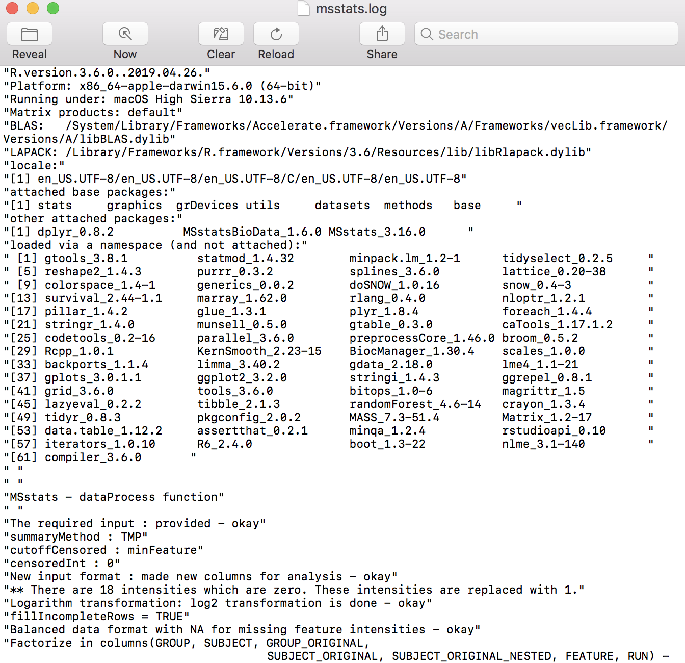{width=90%}

